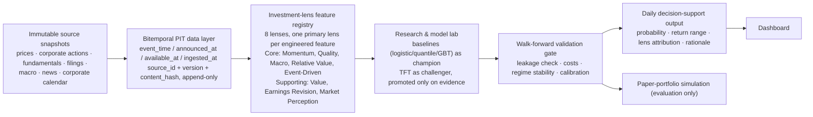

# Sensilnet ATPE — Proposed Architecture v2 (DRAFT, NOT CANONICAL)

**Status:** DRAFT — companion document to ADP-001 through ADP-006. Not yet merged into `docs/ARCHITECTURE.md`.
**Author:** Cola (Claude Desktop + Local MCP)
**Date:** 2026-07-26
**Supersedes intent, not text, of:** `docs/ARCHITECTURE.md` §1–§4 (Protected Sections)
**Derived from:** `docs/INVESTMENT_PHILOSOPHY.md`, `docs/INITIAL_PROPOSAL.md` — re-derived clean-slate, not incrementally patched from v1.
**Vendor posture:** Deliberately vendor-agnostic throughout. Data-rights/coverage evaluation (SGX Data Direct / EODHD / FMP) is still open (see ADP-006, ADP-003). Nothing below assumes a specific provider won; every ingestion point is an adapter interface, not a vendor call.

---

## 0. What Changes and Why (Summary for Reviewers)

The current architecture is model-centric: `data → technical/sentiment features → TFT → execution/backtest`. This draft reorganizes it to be philosophy-led: the investment philosophy's 8 lenses become the organizing structure that data, features, and models are built to serve, per `INVESTMENT_PHILOSOPHY.md` Principle 1 (*"The AI exists to implement an investment philosophy"*).

Four concrete defects in the current (v1) architecture motivate this, each traced to a specific ADP below:

1. **`market_regime_code` (v1 §4.2) conflates three separate philosophies into one hard-coded label** — ADX/ATR (Momentum) + FinBERT sentiment (Market Perception) thresholded into something called "regime," when `INVESTMENT_PHILOSOPHY.md` §5.3 defines Macro Regime purely in terms of rates/inflation/GDP/PMI/FX/central-bank data. This is a philosophy violation, not a style preference. → **ADP-004**
2. **No fundamentals/filings/earnings-estimate tables exist in the current schema at all**, despite `INITIAL_PROPOSAL.md` §4 listing EPS, Debt/Equity, P/E, P/B, Dividend Yield as day-one features, and Quality being a Core Philosophy. → **ADP-003**
3. **Primary keys permit silent overwrite of revised data** — `raw_sgx_daily`, `raw_sgx_corporate_actions`, `raw_sgx_corporate_calendar` all use natural keys with no source-versioning, so a vendor restatement or corrected earnings date silently replaces history with no audit trail. → **ADP-002**
4. **All 8 lenses are implicitly treated as equal, undifferentiated model inputs** — no mechanism in v1 §4.3 reflects `INVESTMENT_PHILOSOPHY.md` §6: *"deliberately rejected the idea of treating them as equal voting systems... Core Philosophies establish the investment thesis. Supporting Philosophies strengthen, weaken or refine confidence."* → **ADP-001**

A fifth, business-layer issue is addressed separately because it reopens an already-Resolved, Matcha-audited disposition-matrix entry (Finding #3) rather than being a pure technical defect:

5. **The 5-name pilot universe cannot support Relative Value as designed** — of the 5 names, only 3 (DBS/OCBC/UOB) form a real peer group; Singtel and SIA are peer-less, while `INVESTMENT_PHILOSOPHY.md` §5.4 names Banks/REITs/Telcos/Property/Shipping/Conglomerates as SGX's natural comparison clusters. → **ADP-006**

---

## 1. Executive System Overview (proposed replacement for v1 §1)

Sensilnet ATPE is a **daily-batch, philosophy-driven research and decision-support engine** for SGX equities. This wording deliberately replaces v1's "prediction and execution framework" — per `INITIAL_PROPOSAL.md` §1, the primary objective is stated as *decision support*, not execution, and no live broker integration exists anywhere in the current codebase. TFT is a **candidate model** evaluated against simpler baselines, not the architecture's organizing principle (Principle 1).

### 1.1 Universe (see ADP-006 for full rationale — this section states the resulting structure only)

Two universes, not one:
- **Dashboard/UI universe:** small, fixed — DBS, OCBC, UOB, Singtel, SIA (retains v1's pilot list; UOB was already present, good — the peer-bank cohort is real for banks specifically).
- **Research/training universe:** broader, sector-grouped (Banks, REITs, Telcos, Property, Shipping, Conglomerates per `INVESTMENT_PHILOSOPHY.md` §5.4), scope contingent on data-rights confirmation (ADP-006, ADP-003). Not finalized in this draft.

Peer-group membership is computed dynamically from sector/industry classification, market cap, and business-model similarity — never a hardcoded list (§5.4 explicit requirement). Membership is versioned, since sector classification itself can change over time.

### 1.2 Target Architecture



**Explicitly out of scope for v2, same as v1:** live broker integration, order routing, real capital. If ever proposed, it is a separately-approved, disabled-by-default future capability — not a default assumption baked into this design (Principle 6 — avoid scope expansion; `INVESTMENT_PHILOSOPHY.md` §9 explicitly disclaims replacing institutional practice).

---

## 2. Data Contracts (proposed replacement for v1 §2 — bitemporal upgrade)

### 2.1 Bitemporal Filtration Guarantee

Retains v1's filtration formalism (§2.1's $\mathcal{F}_t$ definition and PIT adjustment factor math are sound and unchanged — no defect found there). Extends it: every raw fact additionally carries `available_at`, the timestamp at which the ingestion pipeline could actually have retrieved it (may lag `announced_at`/`published_at` due to feed latency). PIT queries filter on `available_at ≤ t`, not `event_time` or `announced_at` alone — this is the field that makes the guarantee testable, not just asserted.

### 2.2 Source Versioning (see ADP-002)

Every raw table gets: `source_id`, `source_version`, `content_hash`, `superseded_by` (nullable FK to a later version of the same logical record). Raw tables are **append-only** — a vendor restatement, corrected dividend, or revised earnings date becomes a new versioned row, never an `UPDATE`. This closes the silent-overwrite gap in v1 §3.1–3.3's natural-key primary keys.

### 2.3 Calendar Availability Tiering (see ADP-002)

Not all "known future" event types carry equal PIT risk. Three tiers, each requiring `announced_at`/`available_at` evidence, prioritized by actual risk:

- **Earnings dates — highest priority.** Exact dates are frequently unconfirmed or revised close to the event; `days_to_earnings` cannot be treated as PIT-safe without an explicit availability timestamp per revision.
- **Ex-dividend dates — required but lower risk.** Still versioned, but typically declared with reliable lead time once announced.
- **Index rebalance windows — required but lowest risk.** Provider-scheduled, most predictable, but not exempt from the same evidence requirement (no field gets a free pass merely because it's usually reliable).

### 2.4 Multi-Horizon Targets, Loss Formulation, Risk Metrics

Retained from v1 §2.2–§2.4 unchanged — no defect identified in the math itself. Horizon set $\mathcal{H} = \{1,3,5,10,20,60\}$ retained as-is pending Phase 2/3 evidence; this draft does not propose changing it.

---

## 3. Storage Architecture (proposed replacement for v1 §3 — schema expansion)

All tables remain in DuckDB per v1 (no defect found in choice of engine). Schema decomposed into raw / curated / feature / label / prediction / validation layers rather than v1's flatter structure, so features and realized labels are never colocated in a way that invites accidental leakage.

### 3.1 Raw Price Table — `raw_sgx_ohlcv` (revision of v1 `raw_sgx_daily`)

```sql
CREATE TABLE IF NOT EXISTS raw_sgx_ohlcv (
    record_id UUID PRIMARY KEY DEFAULT gen_random_uuid(),
    symbol VARCHAR NOT NULL,
    trade_date DATE NOT NULL,
    raw_open DOUBLE NOT NULL,
    raw_high DOUBLE NOT NULL,
    raw_low DOUBLE NOT NULL,
    raw_close DOUBLE NOT NULL,
    volume BIGINT NOT NULL,
    source_id VARCHAR NOT NULL,
    source_version INT NOT NULL,
    content_hash VARCHAR NOT NULL,
    available_at TIMESTAMP NOT NULL,
    ingested_at TIMESTAMP DEFAULT CURRENT_TIMESTAMP,
    superseded_by UUID REFERENCES raw_sgx_ohlcv(record_id)
);
-- Note: no natural-key PRIMARY KEY(symbol, trade_date) — multiple versions
-- of the same (symbol, trade_date) are valid and expected (restatements).
-- "Current" value for PIT purposes = latest version with available_at <= cutoff.
```

### 3.2 Corporate Actions — `raw_sgx_corporate_actions` (revision of v1)

Same versioning pattern as 3.1: `record_id`, `source_id/version/hash`, `available_at`, `superseded_by`. Retains `action_type`/`action_value`/`ex_date`/`announced_date` from v1.

### 3.3 Corporate Calendar — `raw_sgx_corporate_calendar` (revision of v1 — closes ADP-002 gap)

```sql
CREATE TABLE IF NOT EXISTS raw_sgx_corporate_calendar (
    record_id UUID PRIMARY KEY DEFAULT gen_random_uuid(),
    symbol VARCHAR NOT NULL,
    event_date DATE NOT NULL,        -- estimated or confirmed, see event_date_status
    event_type VARCHAR NOT NULL,     -- 'EARNINGS', 'EX_DIVIDEND', 'INDEX_REBALANCE'
    event_date_status VARCHAR NOT NULL, -- 'ESTIMATED', 'CONFIRMED', 'REVISED'
    announced_at TIMESTAMP,          -- NULL only permitted for ESTIMATED rows
    available_at TIMESTAMP NOT NULL, -- when this row was knowable to the pipeline
    source_id VARCHAR NOT NULL,
    source_version INT NOT NULL,
    ingested_at TIMESTAMP DEFAULT CURRENT_TIMESTAMP,
    superseded_by UUID REFERENCES raw_sgx_corporate_calendar(record_id)
);
```

This is the concrete fix for the gap identified in the ADP discussion: v1's calendar table had `event_date` and `ingested_at` only, with no way to prove an earnings date was actually knowable at the cutoff used in a historical feature computation.

### 3.4 New — Fundamentals — `raw_sgx_fundamentals` (see ADP-003)

```sql
CREATE TABLE IF NOT EXISTS raw_sgx_fundamentals (
    record_id UUID PRIMARY KEY DEFAULT gen_random_uuid(),
    symbol VARCHAR NOT NULL,
    period_end DATE NOT NULL,        -- statement period (event_time)
    filed_at TIMESTAMP,              -- when the filing was lodged
    available_at TIMESTAMP NOT NULL, -- when the pipeline could ingest it
    revenue DOUBLE,
    net_income DOUBLE,
    total_assets DOUBLE,
    total_liabilities DOUBLE,
    operating_cash_flow DOUBLE,
    free_cash_flow DOUBLE,
    shares_outstanding BIGINT,
    -- sector-specific extension columns (nullable; populated per sector)
    nim DOUBLE,               -- banks: net interest margin
    cet1_ratio DOUBLE,        -- banks: CET1 capital ratio
    dpu DOUBLE,               -- REITs: distribution per unit
    nav_per_unit DOUBLE,      -- REITs: net asset value per unit
    gearing_ratio DOUBLE,     -- REITs: gearing
    occupancy_rate DOUBLE,    -- REITs: occupancy
    operating_margin DOUBLE,  -- industrials: margin
    source_id VARCHAR NOT NULL,
    source_version INT NOT NULL,
    is_restatement BOOLEAN DEFAULT FALSE,
    ingested_at TIMESTAMP DEFAULT CURRENT_TIMESTAMP,
    superseded_by UUID REFERENCES raw_sgx_fundamentals(record_id)
);
```

Sector-specific columns kept nullable and generic-first, per ADP-003's phased plan: generic statement fields (Revenue, Net Income, Assets, Liabilities, FCF, Shares Outstanding) targeted first from whichever commercial API wins the Phase 0 trial; sector-specific fields (NIM/CET1, DPU/NAV) confirmed separately since they may require SGX-specific sources or document extraction.

### 3.5 New — Announcements/Events — `raw_sgx_announcements` (see ADP-003, ADP-004)

```sql
CREATE TABLE IF NOT EXISTS raw_sgx_announcements (
    record_id UUID PRIMARY KEY DEFAULT gen_random_uuid(),
    symbol VARCHAR NOT NULL,
    announcement_type VARCHAR NOT NULL, -- 'EARNINGS','MNA','MGMT_CHANGE','REGULATORY','LITIGATION','CONTRACT','CAPITAL_RAISE','OTHER'
    published_at TIMESTAMP NOT NULL,
    available_at TIMESTAMP NOT NULL,
    headline VARCHAR NOT NULL,
    body_ref VARCHAR,            -- pointer to stored original document, never re-derived
    source_id VARCHAR NOT NULL,
    source_version INT NOT NULL,
    ingested_at TIMESTAMP DEFAULT CURRENT_TIMESTAMP
);
```

### 3.6 Raw News & Sentiment — `raw_sgx_news_sentiment` (revision of v1)

Same as v1 §3.4, plus `available_at` (v1 only had `published_at`) and source-versioning fields. `regime_tag` retained as diagnostic-only metadata per v1's existing (correct) design — not consumed downstream as a feature.

### 3.7 New — Peer/Sector Classification History — `ref_sector_classification` (see ADP-001, ADP-006)

```sql
CREATE TABLE IF NOT EXISTS ref_sector_classification (
    record_id UUID PRIMARY KEY DEFAULT gen_random_uuid(),
    symbol VARCHAR NOT NULL,
    sector VARCHAR NOT NULL,
    sub_industry VARCHAR,
    market_cap_bucket VARCHAR,
    effective_from DATE NOT NULL,
    effective_to DATE,           -- NULL = current
    source_id VARCHAR NOT NULL,
    ingested_at TIMESTAMP DEFAULT CURRENT_TIMESTAMP
);
```

Dynamic peer groups for Relative Value are computed as a query against this table as-of decision date `t`, never a hardcoded list.

### 3.8 Feature Registry Metadata — `feature_definitions` (new — see ADP-001)

```sql
CREATE TABLE IF NOT EXISTS feature_definitions (
    feature_name VARCHAR PRIMARY KEY,
    primary_lens VARCHAR NOT NULL CHECK (primary_lens IN
        ('MOMENTUM','QUALITY','MACRO_REGIME','RELATIVE_VALUE','EVENT_DRIVEN',
         'VALUE','EARNINGS_REVISION','MARKET_PERCEPTION')),
    lens_role VARCHAR NOT NULL CHECK (lens_role IN ('CORE','SUPPORTING')),
    horizon_weight_prior VARCHAR, -- 'SHORT','MEDIUM','LONG' per INVESTMENT_PHILOSOPHY.md §7 — a modelling prior, not a hard rule
    formula_version VARCHAR NOT NULL,
    source_tables VARCHAR[] NOT NULL,
    availability_lag_days INT,
    owner VARCHAR NOT NULL,
    validation_status VARCHAR NOT NULL CHECK (validation_status IN ('DRAFT','PIT_VALIDATED','PROMOTED','RETIRED'))
);
```

Enforces the one-feature-one-lens rule mechanically (a `CHECK` constraint, not a convention someone has to remember) and gives the traceability table from ADP-001 a queryable backing store instead of being documentation-only.

### 3.9 Feature Values / Labels / Predictions / Validation Results (new — see ADP-001, ADP-005)

```sql
CREATE TABLE IF NOT EXISTS feature_values (
    symbol VARCHAR NOT NULL,
    trade_date DATE NOT NULL,
    feature_name VARCHAR NOT NULL REFERENCES feature_definitions(feature_name),
    value DOUBLE,
    as_of_timestamp TIMESTAMP NOT NULL,
    PRIMARY KEY (symbol, trade_date, feature_name)
);

CREATE TABLE IF NOT EXISTS label_values (
    symbol VARCHAR NOT NULL,
    trade_date DATE NOT NULL,
    horizon INT NOT NULL,
    target_return DOUBLE,
    target_direction INT,
    realized_at TIMESTAMP NOT NULL,
    PRIMARY KEY (symbol, trade_date, horizon)
);
-- Deliberately separate from feature_values: no label ever lives in the
-- same table/row context that a feature-construction query touches.

CREATE TABLE IF NOT EXISTS model_runs (
    run_id UUID PRIMARY KEY DEFAULT gen_random_uuid(),
    model_name VARCHAR NOT NULL,      -- e.g. 'baseline_logistic_h1', 'tft_challenger'
    model_role VARCHAR NOT NULL CHECK (model_role IN ('CHAMPION','CHALLENGER','RETIRED')),
    code_commit_hash VARCHAR NOT NULL,
    feature_set_version VARCHAR NOT NULL,
    trained_at TIMESTAMP NOT NULL,
    config JSON
);

CREATE TABLE IF NOT EXISTS predictions (
    run_id UUID NOT NULL REFERENCES model_runs(run_id),
    symbol VARCHAR NOT NULL,
    trade_date DATE NOT NULL,
    horizon INT NOT NULL,
    prob_up DOUBLE,
    q10 DOUBLE, q50 DOUBLE, q90 DOUBLE,
    lens_attribution JSON,   -- per-lens contribution for explainability
    confidence VARCHAR CHECK (confidence IN ('HIGH','MEDIUM','LOW','WITHHELD')),
    PRIMARY KEY (run_id, symbol, trade_date, horizon)
);

CREATE TABLE IF NOT EXISTS validation_results (
    run_id UUID NOT NULL REFERENCES model_runs(run_id),
    validation_type VARCHAR NOT NULL, -- 'WALK_FORWARD','PIT_REPLAY','REGIME_STABILITY'
    regime_bucket VARCHAR,
    metric_name VARCHAR NOT NULL,
    metric_value DOUBLE,
    passed BOOLEAN NOT NULL,
    evaluated_at TIMESTAMP DEFAULT CURRENT_TIMESTAMP
);
```

---

## 4. Subsystem Deep-Dive (proposed replacement for v1 §4)

### 4.1 Ingestion & PIT Storage Engine (`src/data/`)

Same responsibility as v1 §4.1, extended: `ingest_sgx.py` becomes a **vendor-adapter dispatcher** — a thin interface (`BaseVendorAdapter`) that any provider (SGX Data Direct, EODHD, FMP, or a PDF-extraction fallback) implements, normalizing to the schemas in §3 above. No component downstream of ingestion knows or cares which vendor is active. `pit_store.py` retains v1's ASOF-join/adjustment-factor responsibility, extended to resolve `superseded_by` chains when computing "the value known as of `t`."

### 4.2 Feature Engineering & Lens Registry Pipeline (`src/features/`)

Replaces v1's flat `build_features.py` with one module per lens (`features/momentum.py`, `features/quality.py`, `features/macro.py`, `features/relative_value.py`, `features/event_driven.py`, `features/value.py`, `features/earnings_revision.py`, `features/market_perception.py`), each registering its outputs into `feature_definitions` (§3.8) with a mandatory `primary_lens` tag. One raw input may feed multiple lenses through different transforms (raw ROE → Quality; peer-relative ROE spread → Relative Value), but each **derived** feature carries exactly one lens.

**`market_regime_code` is removed entirely** (see ADP-004). Its constituent signals survive as separately-tagged features: ADX/ATR remain Momentum features; FinBERT sentiment remains a Market Perception feature; actual macro data (rates, inflation, PMI, FX) become the real Macro Regime features. No categorical fused label is computed anywhere in the pipeline.

`shap_selector.py` retained from v1, applied per-horizon within the champion-challenger governance flow (§4.3) rather than pipeline-wide.

### 4.3 Model Architecture Subsystem (`src/models/`)

Replaces v1's TFT-only design with a **champion-challenger structure with Core/Supporting gating** (see ADP-001, ADP-005):

- **Baseline champions** (per horizon): regularized logistic regression (directional) + quantile regression / gradient-boosted trees (return range), trained on **Core-lens features only** (Momentum, Quality, Macro Regime, Relative Value, Event-Driven) to establish the base investment thesis.
- **Supporting-lens gating layer**: Value, Earnings Revision, Market Perception features feed a learned modifier (e.g., a gating network or secondary calibration stage) that strengthens, weakens, or qualifies the Core-lens base signal — not concatenated as equal-weight inputs. This directly implements `INVESTMENT_PHILOSOPHY.md` §6's Core/Supporting hierarchy, and does so via learned, horizon-specific weighting rather than a hand-coded rule, preserving Principle 5.
- **Challenger**: TFT (`pytorch-forecasting`, per `INITIAL_PROPOSAL.md` §5), introduced only after baseline champions and the data foundation are proven. Static/known-future/observed-past input structure retained from v1 §4.3, with `market_regime_code` removed and replaced by its constituent raw features.
- **Promotion rule**: a challenger replaces a champion only if it beats it out-of-sample, after transaction costs, calibrated, across multiple historical regime buckets — recorded in `validation_results` (§3.9), not asserted in prose.
- **Horizon-weighting prior**: per `INVESTMENT_PHILOSOPHY.md` §7, Quality/Value naturally carry more weight at long horizons, Event-Driven/Market Perception/Earnings Revision at short horizons, Momentum/Macro/Relative Value at medium horizons. Implemented as a **modelling prior and evaluation lens** (`feature_definitions.horizon_weight_prior`), not a hard filter — the model may still learn otherwise if evidence supports it.

### 4.4 NLP & Sentiment Subsystem (`src/features/market_perception.py`, renamed from v1's `sentiment.py`)

Same extraction responsibility as v1 §4.4 (FinBERT polarity, PIT timestamp filtering). Renamed to align with `INVESTMENT_PHILOSOPHY.md` §5.8's explicit reframing from generic "sentiment" to "Market Perception" (narrative, tone, uncertainty — not just polarity). Output feeds the Supporting-lens gating layer in §4.3, not a fused regime label.

### 4.5 Evaluation & Backtesting Engine (`src/backtest/`)

Retains v1's cost model verbatim (Brokerage 0.08% min SGD 10, Clearing 0.0075%, Access 0.005%, slippage formula) — no defect found here. Reframed as **paper-portfolio simulation for evaluation**, not an execution engine — consistent with §1's decision-support framing. Produces the metrics v1 specified (win rate, MAE, MDD, Sharpe/Sortino, profit factor) per horizon **and** per regime bucket (new — needed for the promotion-rule stability check in §4.3).

---

## 5. Roadmap (Shared section — see ADP-005 for gate definitions)

Recast as gated phases rather than a fixed week count, per the disagreement/resolution discussion already logged in `SESSION_HANDOFF.md`. Full gate criteria are defined in ADP-005 (model governance) and ADP-002 (PIT replay); summarized here for the roadmap view only:

| Phase | Focus | Gate (see ADPs for full definition) |
|---|---|---|
| 0 | Data-rights & coverage evaluation (SGX Data Direct / EODHD / FMP trial) | Provider scorecard produced; universe scope confirmed |
| 1 | Bitemporal foundation — schemas in §3, vendor-adapter interface | As-of replay reproducible within stated tolerance; no not-yet-available data admitted |
| 2 | Feature registry — all 8 lenses at MVP depth | Every feature: one lens, one owner, documented availability lag, passes PIT validation |
| 3 | Baseline champions + Core/Supporting gating | Beats named naive benchmarks out-of-sample, calibrated by horizon |
| 4 | TFT challenger | Beats baseline champion after costs; stable across ≥2/3 historical regimes (sample-size/CI reported, not just pass/fail) |
| 5 | Daily batch pipeline + publication gate | Full pre-market run completes; withheld-status logic verified end-to-end |

This section is Shared per `WORKFLOWS.md` §5.1 — Beer may refine task granularity directly into `HANDOFF.md` once the ADP bundle below is approved; no additional ADP required for that refinement alone.

---

## 6. What Is Deliberately Not Changing

To keep this review scoped to actual defects rather than a wholesale rewrite for its own sake (Principle 6):
- DuckDB as the storage engine — retained.
- PIT filtration math (§2.1–§2.2 formulas) — retained verbatim, no defect found.
- Transaction cost model (§4.5) — retained verbatim.
- `pytorch-forecasting`/TFT as the challenger model family — retained, per `INITIAL_PROPOSAL.md` §5.
- Horizon set $\mathcal{H} = \{1,3,5,10,20,60\}$ — retained pending Phase 3/4 evidence.
- No live execution, no broker integration, no intraday/HFT — retained as explicit non-goals.
